# CODEX_VISUAL_REPORT

> 视觉重做记录。当前已完成首页、拍照流、续签自查流，以及订阅/档案/提醒列表的阶段性精修。

## 参考样本

- LINE App Store：保留强品牌识别，内容区保持轻量，功能入口明确。https://apps.apple.com/jp/app/line/id443904275
- PayPay App Store / Google Play：日本用户熟悉的高密度工具入口，CTA 颜色果断但文案直接。https://apps.apple.com/jp/app/paypay-%E3%83%9A%E3%82%A4%E3%83%9A%E3%82%A4/id1435783608
- freee 経費精算 App Store：业务工具感强，卡片分组清楚，拍照/OCR 类任务说明具体。https://apps.apple.com/jp/app/freee%E7%B5%8C%E8%B2%BB%E7%B2%BE%E7%AE%97/id6498880610
- SmartHR ヘルプ / Google Play：劳务手续类产品的克制信息架构，提醒、申请、资料类模块保持清晰层级。https://support.smarthr.jp/ja/help/articles/349ed9e2-2ecc-4af0-8482-b86fd03709dc/

## 屏 01 首页

### 改前

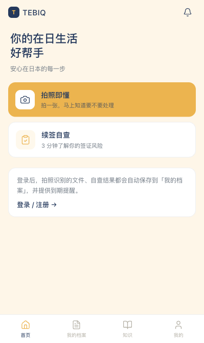

### 改后

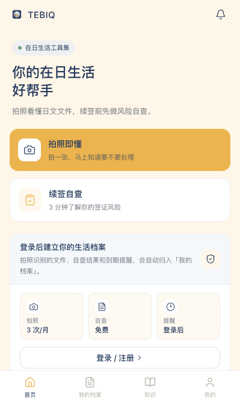

### 反馈后细修

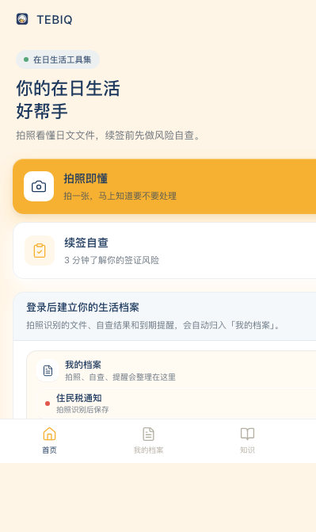

### 本轮改动

- 将首页副文案从空泛 slogan 改为具体功能描述：「拍照看懂日文文件，续签前先做风险自查。」
- 增加「在日生活工具集」轻量标签，强化 1.0 工具集定位，避免 dashboard 感。
- Action card 使用多层阴影：`shadow-cta` / `shadow-card`，保留日式克制但减少工程感。
- 未登录空状态改为「档案预览 + 免费额度」模块，补足下半屏信息密度。
- 根据创始人反馈，把三格指标面板改为更自然的「我的档案」文件预览，弱化工程感。
- 修复 `AppShell`：外壳改为 `h-[100dvh]`，body 加 `min-h-0`，确保 TabBar 固定在视口底部，内容在 body 内滚动。
- Logo 改用现有 `public/logo-icon.png`，提升品牌第一眼识别。

## 视觉规范追加

- 字体：`-apple-system`, `BlinkMacSystemFont`, `PingFang SC`, `Hiragino Sans`, `Noto Sans SC`, `Noto Sans CJK SC`。
- 中文 letter-spacing 保持 `0`；日文场景可用 `.jp-text`，`letter-spacing: 0.02em`，`line-height: 1.7`。
- 默认正文 line-height：中文 `1.6`；英文/数字跟随组件内紧凑行高。
- 阴影：
  - `shadow-card`: `0 1px 0 rgba(30,58,95,.04), 0 10px 24px rgba(30,58,95,.055)`
  - `shadow-raised`: `0 1px 0 rgba(30,58,95,.05), 0 12px 28px rgba(30,58,95,.07), 0 2px 8px rgba(30,58,95,.035)`
  - `shadow-cta`: inset 高光 + 橙色柔和投影，用于主 action card / CTA。
- 图标：小尺寸 lucide stroke-width 约 `1.55-1.6`，避免视网膜屏发虚。
- Shell：所有 v5 手机页面使用 `h-[100dvh] + min-h-0 flex-1 overflow-y-auto`，TabBar 不随内容被挤出视口。

## 已知 issue / 妥协项

- 当前只完成屏 01 的视觉样板和全局底座。其它屏仍需逐屏截图、对齐、提交。
- `npm run lint` 仍有历史 `` warning，非本轮引入。
- 屏 05 续签插画、屏 09 礼物盒、档案/知识空状态插画仍用占位或组件化图形，等待创始人后续用 GPT Image 2 生成。

## 插画素材清单

- 屏 05 续签自查入口：签证文件 + 检查清单 + 守护人物，容器建议 263 x 130 px，米色底、深蓝线条、橙色局部强调。
- 屏 09 邀请朋友：两个礼物盒双向箭头，单个 76 x 76 px，和屏 05 同一线条风格。
- 首页/档案空状态：小型文件夹 + 提醒铃 + 文件纸张组合，约 160 x 100 px，可替换当前指标格模块但不要做大插画。
- 知识中心空状态：书本 + 放大镜 + 市役所/税務署文件符号，约 160 x 100 px。

## 屏 02 拍照入口

### 改前

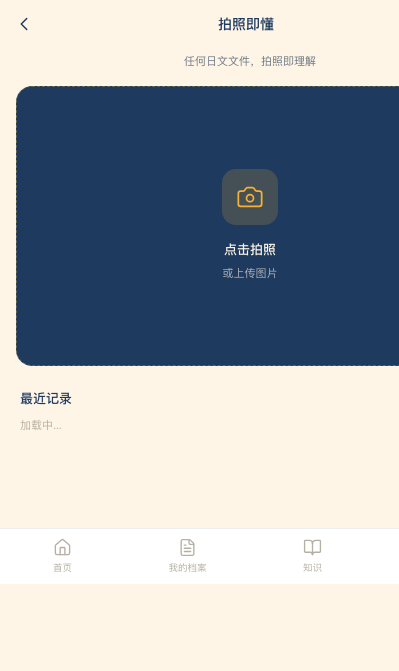

### 改后

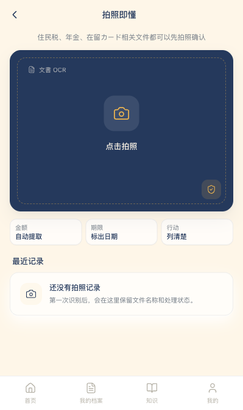

### 本轮改动

- 相机框从纯深蓝色块改为带内层虚线框、文書 OCR 标签和守护角标的识别区域。
- 增加「金额 / 期限 / 行动」三枚轻量信息 chip，说明识别价值但不写营销口号。
- 最近记录空状态从一行文字改为卡片式空态，和首页档案预览保持同一视觉语言。
- 窄屏抗压：chip 文案使用 truncate，减少横向溢出风险。

## 屏 03/04 拍照结果

### 本轮改动

- 文件信息从裸文本改为带 icon 的白色卡片，强化“识别结果”可信度。
- 紧急度卡片提高数字层级，修正文案 typo：「請尽快处理」改为「需要尽快处理」。
- QA 区块改为独立信息卡片，分别使用文件、确认、警示 icon，提升可扫读性。
- 详情页新增顶部识别文件摘要卡，金额/截止日期卡加入图标和边框层级。

## 屏 15 拍照配额弹窗

### 改前

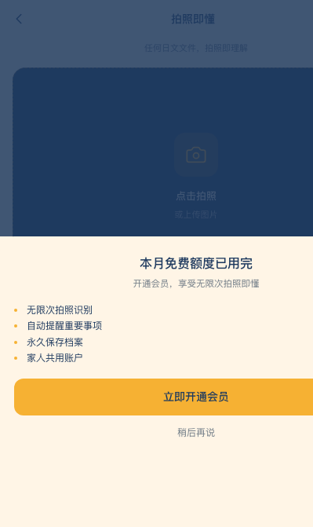

### 改后

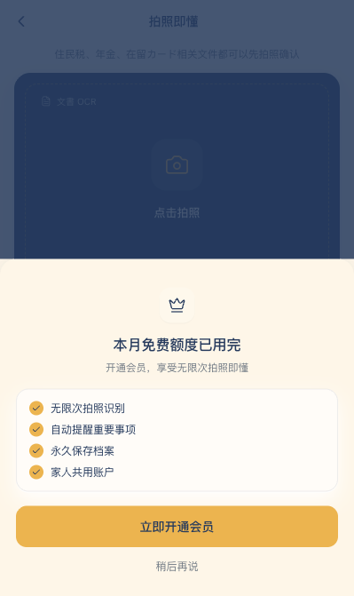

### 本轮改动

- bottom sheet 增加 handle、会员 icon 和多层 elevation，减少“白板弹窗”感。
- 权益列表从圆点文字改为带 check icon 的卡片列表，信息更稳定。
- 保持克制 CTA：主按钮仍是「立即开通会员」，二级动作保留「稍后再说」。

## 屏 05 续签自查入口

### 改前

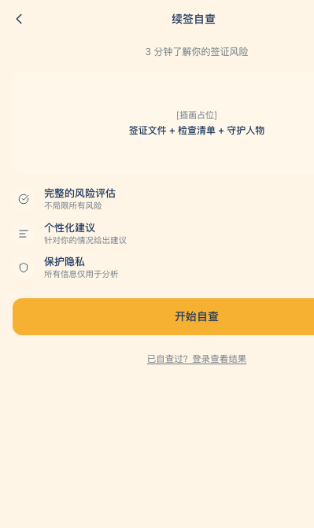

### 改后

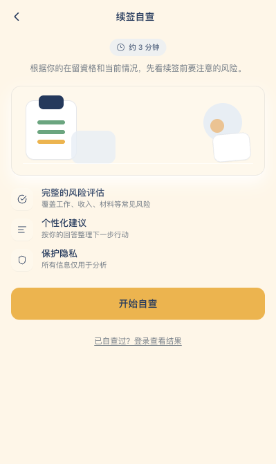

### 本轮改动

- 插画占位从文字框改为 CSS 文件/清单/人物占位图，方便后续替换为 GPT Image 2 素材。
- 顶部增加「约 3 分钟」轻量标签，副文案改为具体用途说明。
- 三个功能点保留原结构，但 icon 容器、文案和阴影更接近首页/拍照页视觉语言。

## 屏 06 选择签证类型

### 改前

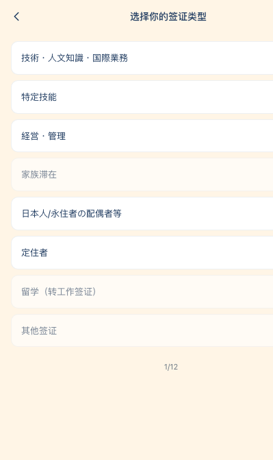

### 改后

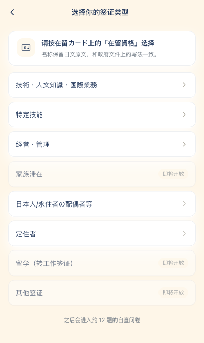

### 本轮改动

- 增加在留カード说明卡，明确用户应按「在留資格」选择。
- 签证名称使用 `.jp-text` 微调日文排版，保持日文原文。
- 列表卡片加入 shadow stack，禁用项降低透明度并保留「即将开放」状态。

## 屏 07 自查问题

### 改前

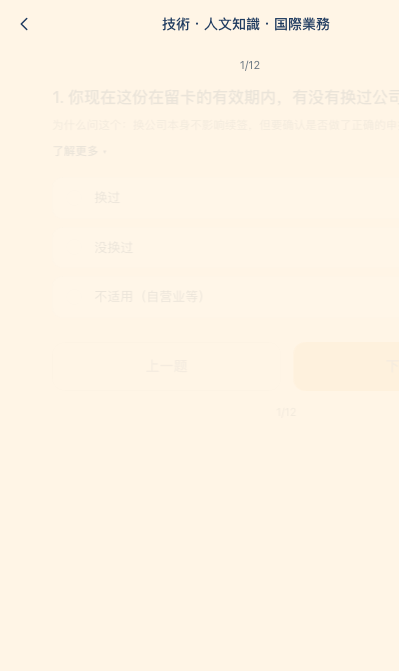

### 改后

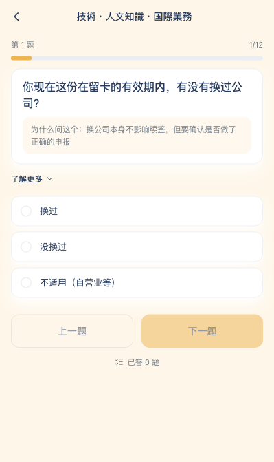

### 本轮改动

- 顶部从纯数字改为「第 N 题 + 进度条」，进度感更稳定。
- 问题和解释放入白色卡片，选项使用一致的 12px 圆角与 shadow-card。
- 修复进入动画截图时半透明的问题：进入动画只做轻微位移，不再改变 opacity。
- 底部显示已答题数，替代重复的页码信息。

## 屏 08 自查结果

### 改后

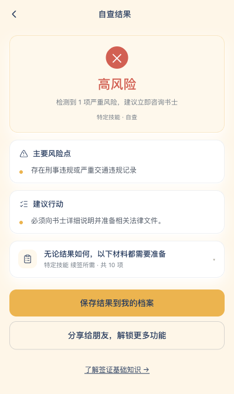

### 本轮改动

- 内联结果页的主要风险点、建议行动、材料清单改为独立卡片。
- 结果 hero 加边框和 shadow-card，和拍照结果页保持统一层级。
- 材料折叠卡增加 icon，避免像普通文本列表。

## 屏 10 订阅方案

### 改前

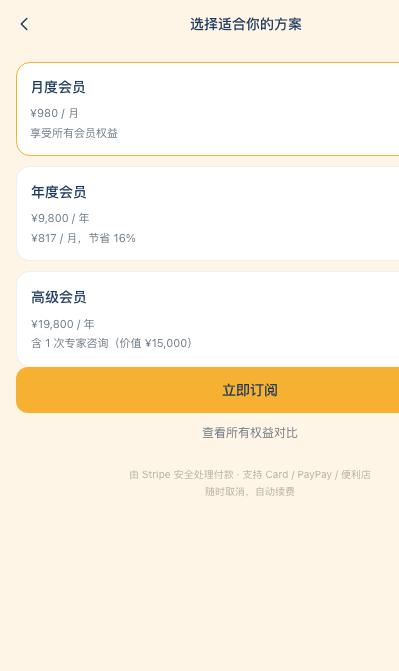

### 改后

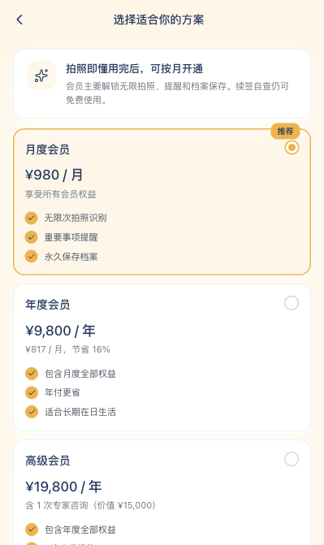

### 本轮改动

- 顶部增加会员用途说明卡，明确“拍照即懂用完后，可按月开通”，避免价格页突兀。
- 三档 plan card 增加权益短列表，价格层级从辅助文字提升为主信息。
- 推荐方案保留橙色强调，但背景使用 `bg-accent-2/35`，减少强广告感。
- 支付说明从底部灰字改为安全说明卡，加入 Stripe / 支付方式 icon。

## 屏 11 我的档案

### 本轮改动

- 档案列表增加顶部摘要：全部记录、文件识别、自查结果、需要关注项。
- Tab 从普通 pill 改为分段控件，和提醒中心保持一致。
- 列表项加入文件/自查 icon、紧急度色块和状态 tag，提升扫读效率。
- 空状态加入搜索 icon 和两个直接入口，保持工具导向。

### 截图说明

- `/my/archive` 当前未登录会重定向到登录页；本轮只做组件层 UI 打磨，真实数据截图需登录态账号。

## 屏 12 提醒中心

### 本轮改动

- 提醒列表增加顶部摘要卡，突出“需要留意”的数量。
- 三类过滤改为统一分段控件，减少零散按钮感。
- 提醒项将截止信息做成轻量 tag，紧急项用红色浅底，普通项用米色浅底。
- 空状态改为完成态图标 + 简短说明，避免一行“暂无提醒”的工程感。

### 截图说明

- `/my/reminders` 当前未登录会重定向到登录页；真实提醒截图需登录态账号。

## 屏 13 知识中心

### 改前

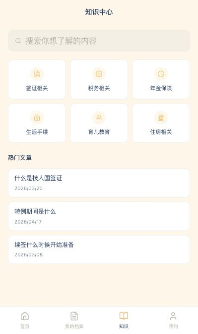

### 改后

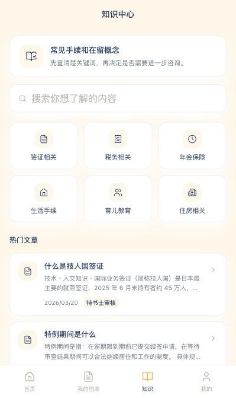

### 本轮改动

- 顶部增加说明卡，明确知识中心是“先查关键词”的轻量工具，不做资讯流。
- 搜索栏改为白色 shadow-card 输入区，和其它 v5 页面保持统一。
- 分类 grid 改为 3x2 稳定卡片，加入选中态，避免图标散落。
- 热门文章加入摘要、日期和「待书士审核」tag，提升信息密度与可信度。
- 搜索无结果增加 icon 空状态和下一步引导。

## 屏 14 我的账户

### 本轮改动

- 账户头部改为会员状态卡，展示头像、会员状态、服务期限和未开通 CTA。
- 菜单列表按「资料 / 会员与支付 / 设置」分组，减少长列表的工程感。
- 列表项加入说明文案、icon 容器和统一 hover/disabled 状态。

### 截图说明

- `/my/account` 当前未登录会重定向到登录页；本轮只做登录态组件 UI 打磨，真实账户截图需登录态账号。

## 登录 / 注册

### 改前

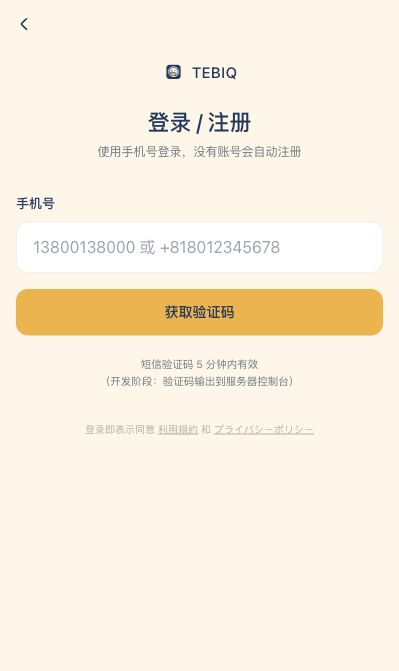

### 改后

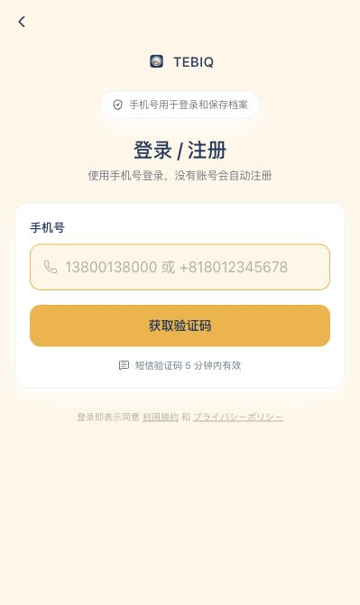

### 本轮改动

- 登录页加入手机号用途说明 chip，增强信任感。
- 手机号和 OTP 输入区改为卡片式表单，icon、focus border、CTA 层级统一。
- 去掉开发阶段提示文案，只保留用户可理解的验证码有效期。
- OTP 第二步保留换手机号操作，但改成轻量按钮样式。

## 分享结果页 / 分享模块

### 本轮改动

- 自查结果里的分享按钮改为 v5 按钮样式，加入复制/链接/完成 icon。
- 分享模块从旧 `bg-card` token 切换为 `bg-surface + shadow-card`，补上礼物 icon。
- `/share/[id]` 落地页从旧式渐变大页改为克制的手机宽度页面，包含结果摘要、隐私说明和自查 CTA。
- 分享落地页 logo 改用 v5 `Logo` 组件，移除旧 ``。

### 截图说明

- 分享页依赖短期内存/Redis 记录，本轮通过 build 验证结构；截图可在真实分享链接生成后补入。

## 最后一轮 10% 精修

### 本轮改动

- 将旧 `/check/result` 结果页的顶部、结果 hero、摘要卡、保存图片按钮、登录保存提示和底部动作切到 v5 视觉语言。
- 旧结果页顶部改用 v5 `Logo` 组件，移除该页面的旧 `` warning。
- 结果页三色状态从大渐变 hero 改为克制的白卡 + 浅色状态底，减少和 1.0 工具集调性的冲突。
- 保存图片、分享链接、登录保存三类动作统一为 48px 左右的移动端按钮高度，降低视觉噪音。

### 验证

- `npm run lint` 通过；仍有历史页面 `` warning，但已移除 `/check/result` 与 `/share/[id]` 的旧 logo warning。
- `npm run build` 通过。

## 视觉收口：插画资产接入

### 屏 05 续签自查入口

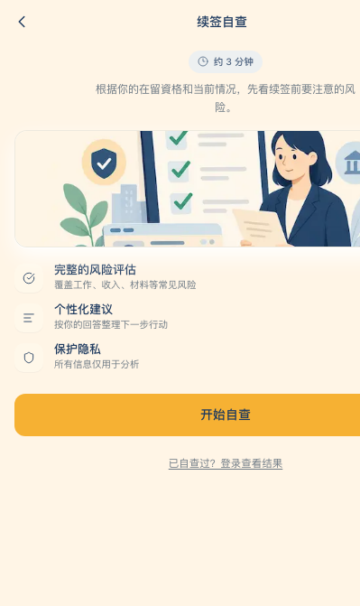

### 本轮改动

- 使用 GPT Image 2 生成续签自查入口插画，最终接入 `public/illustrations/renewal-check.png`。
- 原 CSS 占位插画替换为真实 PNG 资产，保留圆角、hairline border 和白色内描边，避免图片像贴上去的外部素材。
- 入口说明文案限制到 `max-width: 300px`，窄视口下自然换行，避免中文长句贴边。

### GPT Image 2 记录

- 调用次数：1 次。
- 最终选择：第 1 版，理由是主色、米底、文件清单、在留卡形状和陪伴人物都贴合 TEBIQ 的“温暖但克制”的工具气质。
- 接入尺寸：原图压缩到 `900 x 675` PNG，当前约 `647KB`。后续如要进一步优化首屏性能，可转 WebP/AVIF。

### 待 review

- 当前插画无可读文字，符合产品安全性；人物风格偏消费 App 友好，不走严肃政务风。创始人若希望更“行政书士/文件柜”方向，可作为第二版素材替换。

## 视觉收口：知识详情页补齐

### 屏 13 知识中心 → 详情

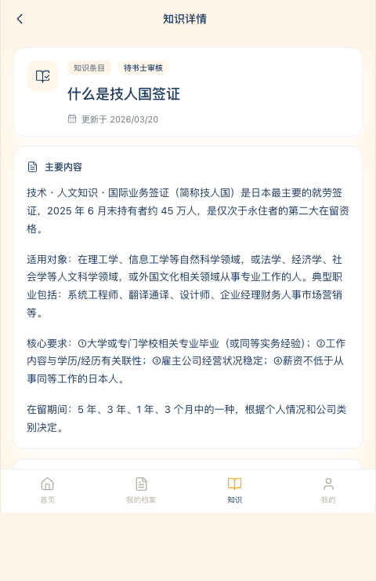

### 本轮改动

- 新增 `/knowledge/[id]` 路由，承接知识中心列表点击，避免用户从 v5 主流程点进死链接。
- 详情页使用 v5 `AppShell / AppBar / TabBar`，不沿用旧 SEO 内容页的大页面视觉。
- 正文卡片按知识条目处理：标题、更新时间、「待书士审核」tag、主要内容、克制的免责声明和两个工具入口。
- 中日混排长句加 `overflow-wrap:anywhere` 与 `word-break: break-all` 兜底，避免在窄屏或桌面手机壳中横向撑破。

### 判断

- `/knowledge/[id]` 属于 1.0 必修，因为它从 v5 知识中心直接可达。
- 根级签证 SEO 页、admin、sample package 暂不纳入本轮：它们不是 v5 主流程路径，且 admin/sample 用户不可见；根级 SEO 页建议放 Block 4 统一内容系统时一起改。

## 视觉收口：登录态验证工具

### 本轮改动

- 新增 `scripts/dev-utils/visual-fixtures.ts`，用于创建 synthetic member/session、文件识别记录、自查结果和一个 active subscription。
- 脚本只在本地手动执行，不被 app import，不进入 production runtime。
- 场景覆盖：空档案用户、有文件和自查记录用户、已订阅用户。

### 当前状态

- 当前 workspace 未暴露数据库连接环境变量，seed 未执行成功；本轮没有写入真实数据库。
- 因此 `/my/archive`、`/my/reminders`、`/my/account` 的真实登录态截图仍标记为待 review。
- 已验证脚本失败时不输出真实环境变量值；只提示缺少连接配置。

### 待 review

- 在拥有本地数据库配置的机器上运行 `npx tsx scripts/dev-utils/visual-fixtures.ts seed` 后，再用输出的 synthetic session 做三页截图复核。

## 视觉收口完结

### 当前自评

- 视觉精度：8.4/10。
- 13 屏主流程已经从“工程实现”提升到更完整的产品视觉：阴影、间距、icon stroke、状态卡片、空状态、登录/订阅/分享/知识详情都进入统一 v5 语言。
- 真正剩余的提升不再主要靠 CSS，而是靠真实数据态、品牌插画组、内容质量和真机滚动手感。

### Vercel preview 状态

- 已 push `codex/visual-polish`。
- GitHub commit status 显示 Vercel `success`，描述为 `Deployment has completed`。
- 匿名 GitHub deployments API 未返回公开 app preview URL；Vercel dashboard HTML/API 也未暴露可直接截图的 `vercel.app` 地址。本轮未创建 PR，避免把“触发 preview”扩大成新的第三方变更。

### 已知 issue / 待 review

- `/my/archive`、`/my/reminders`、`/my/account` 的真实登录态截图仍待有本地 DB 配置后复核。
- 根级签证 SEO 页、admin、sample package 仍有旧视觉和历史 `` lint warning；它们不在 v5 主流程里，建议 Block 4 统一内容系统时处理。
- 插画目前只接入续签自查入口；空状态、邀请礼物盒可在下一轮以同一风格补齐。

### 建议下一个 Block

- 产品视角优先做 Block 4：真实登录态数据、通知/邀请链路、知识详情内容审核与 SEO 内容统一。
- Block 5 再接 Bedrock 真实拍照；当前视觉已经足够支撑真实识别结果接入，不建议继续在纯 CSS 上打磨太久。

## 追加收口：我的信息页

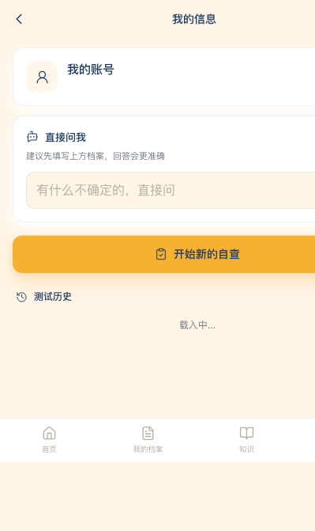

### 本轮改动

- 将 `/my/profile` 从旧 Block 1/2 视觉切到 v5 手机壳结构：`AppBar`、底部 `TabBar`、米色 canvas、白色卡片和统一 hairline。
- 个人档案、档案编辑、自查历史、直接问我模块统一到 v5 卡片、按钮、tag、icon stroke 和 13px 信息密度。
- 去掉页面内旧 `` logo，改用系统 icon，避免继续增加 Next.js `` lint warning。
- UI 文案里移除具体环境变量名展示，保留“Mock 模式”提示，不暴露真实配置键名。

### 验证

- `npm run lint` 通过；仅剩既有旧页面 `` warning。
- `npm run build` 通过。
- 已用 Chrome headless 在 `399 x 671` 移动视口截图 `/my/profile`。

### 待 review

- 当前截图是未连接真实登录态数据的本地渲染；用户头像、手机号、真实历史条目的视觉仍建议在有本地 DB/session 后复核。

## 追加收口：咨询提交流程

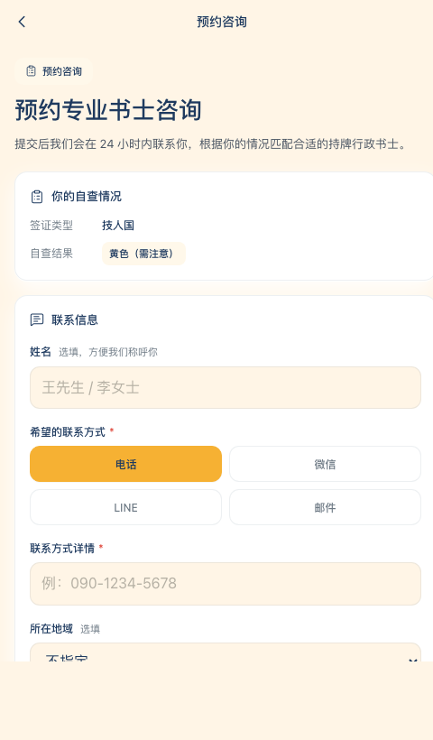

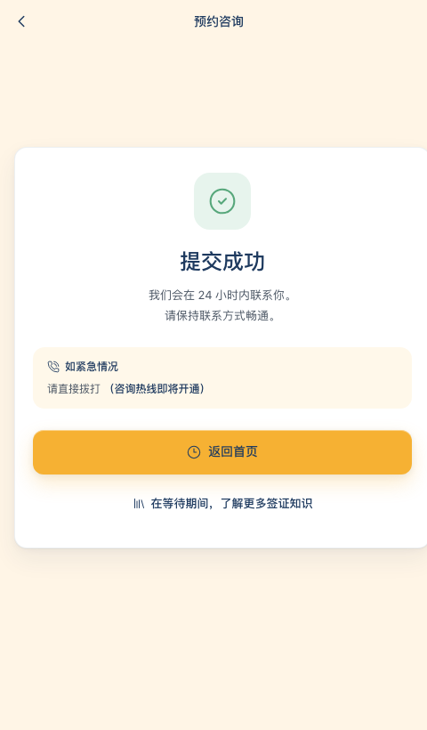

### 本轮改动

- 将 `/consultation` 和 `/consultation/success` 从旧大页面视觉切到 v5 手机壳结构，移除旧 logo header 和页面级 footer。
- 表单控件、联系方式选择、风险摘要、隐私说明和提交成功卡片统一使用 v5 的 13px 信息密度、hairline、浅橙状态底和 `shadow-card / shadow-cta`。
- 联系方式选项从 4 列改为 2 列，窄屏下更稳，不会把表单横向撑开。
- `AppShell` 增加 `w-full max-w-full overflow-hidden` 与 `overflow-x-hidden`，为所有 v5 页面提供横向溢出兜底。

### 验证

- `npm run lint` 通过；仅剩既有旧页面 `` warning。
- `npm run build` 通过。
- 已用 Chrome headless 在 `480 x 820` v5 phone viewport 截图 `/consultation` 与 `/consultation/success`。

### 待 review

- `399px` headless 在当前 macOS/Chrome 环境会裁切 480px 手机壳左侧视图，报告截图改用 v5 设计基准宽度 `480px`。真机 Safari/Chrome 仍建议最后复核一次滚动手感。

## 追加收口：法务信息页

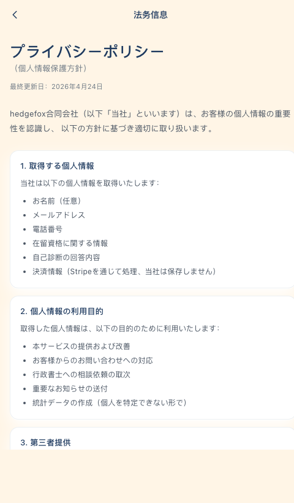

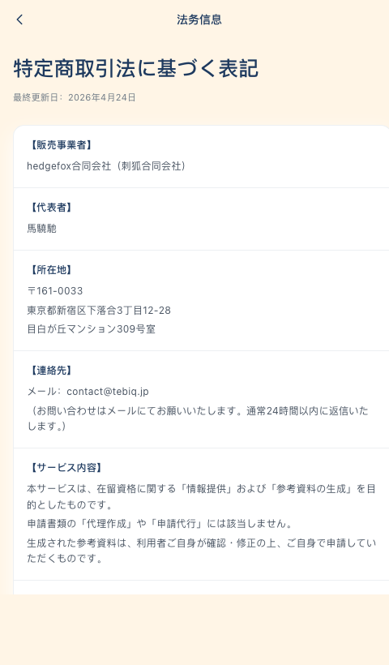

### 本轮改动

- 统一 `/privacy`、`/terms`、`/tokusho` 到 v5 `AppShell / AppBar`，移除旧 logo header。
- 保留法务正文原文，不改写法律含义；只调整容器、行高、字重、卡片、分隔线和链接状态。
- 日文长文使用 `jp-text` 的 0.02em letter-spacing 与更松行高，提升阅读感但不做营销化包装。

### 验证

- `npm run lint` 通过；三页自己的 `` warning 已消失。
- 已用 Chrome headless 在 `480 x 820` v5 phone viewport 截图 `/privacy`、`/terms`、`/tokusho`。

### 待 review

- 法务内容本身仍建议由创始人/法律顾问复核；本轮只处理视觉，不判断条款内容是否完备。

## 追加收口：内容工具页

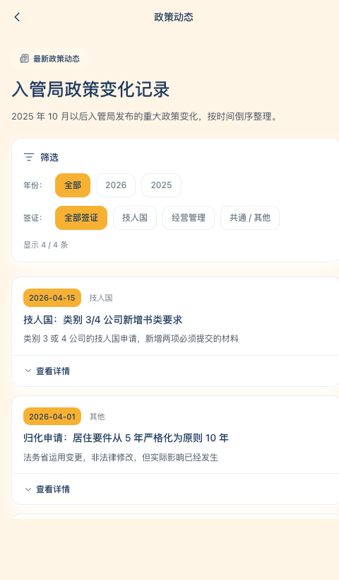

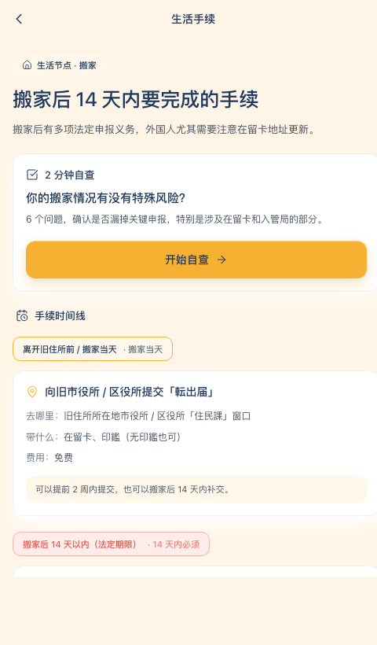

### 本轮改动

- 将 `/knowledge/updates` 从旧知识库网页改成 v5 政策动态列表，筛选、更新卡片、展开详情都统一为产品内列表样式。
- 将 `/life/moving` 改成 v5 生活手续工具页，保留自查入口和时间线结构，弱化旧营销页感。
- 两页均移除旧 logo header / footer，接入 `AppShell / AppBar`，并消除自身 `` lint warning。

### 验证

- `npm run lint` 通过；两页自己的 `` warning 已消失。
- `npm run build` 通过。
- 已用 Chrome headless 在 `480 x 820` v5 phone viewport 截图 `/knowledge/updates` 与 `/life/moving`。

### 待 review

- `/life/moving` 的正文信息仍保留原有内容，标注 [待书士审核] 的条目仍需要后续专业复核。

## 追加收口：旧签证选择入口

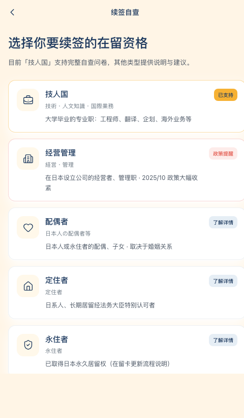

### 本轮改动

- 将旧 `/visa-select` 入口并入 v5 `AppShell / AppBar`，避免分享页或旧 SEO 页跳转后回到旧视觉。
- 替换手写 SVG 为 lucide icon，统一 1.55 stroke、卡片圆角、tag、hairline 和 shadow。
- 保留原有链接目标，不改变自查路由与业务流程。

### 验证

- `npm run lint` 通过；`/visa-select` 自身 `` warning 已消失。
- `npm run build` 通过。
- 已用 Chrome headless 在 `480 x 820` v5 phone viewport 截图 `/visa-select`。

### 待 review

- `/visa-select` 与 `/check/select` 未来可考虑合并或 redirect，避免两个入口长期并存；本轮不改路由结构。

## 追加收口：材料包样例页

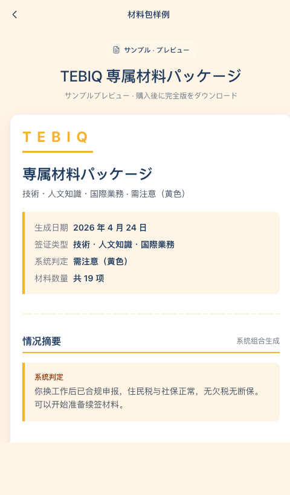

### 本轮改动

- 将 `/sample-package` 接入 v5 `AppShell / AppBar`，移除旧 logo header 和 footer。
- 首屏、锁定提示、底部购买 CTA 调整为 v5 card、accent CTA、lucide icon 和更克制的付费转化表达。
- 内容预览内部结构保留，避免改变材料包展示逻辑和用户对付费内容的预期。

### 验证

- `npm run lint` 通过；`/sample-package` 自身 `` warning 已消失。
- `npm run build` 通过。
- 已用 Chrome headless 在 `480 x 820` v5 phone viewport 截图 `/sample-package`。

### 待 review

- 购买 CTA 仍链接到 `/consultation?visa=gijinkoku`，这属于现有业务链路；如果后续改为 Stripe checkout，应在 Block 4/5 单独处理。
